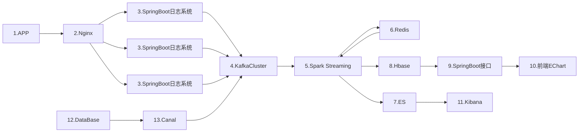
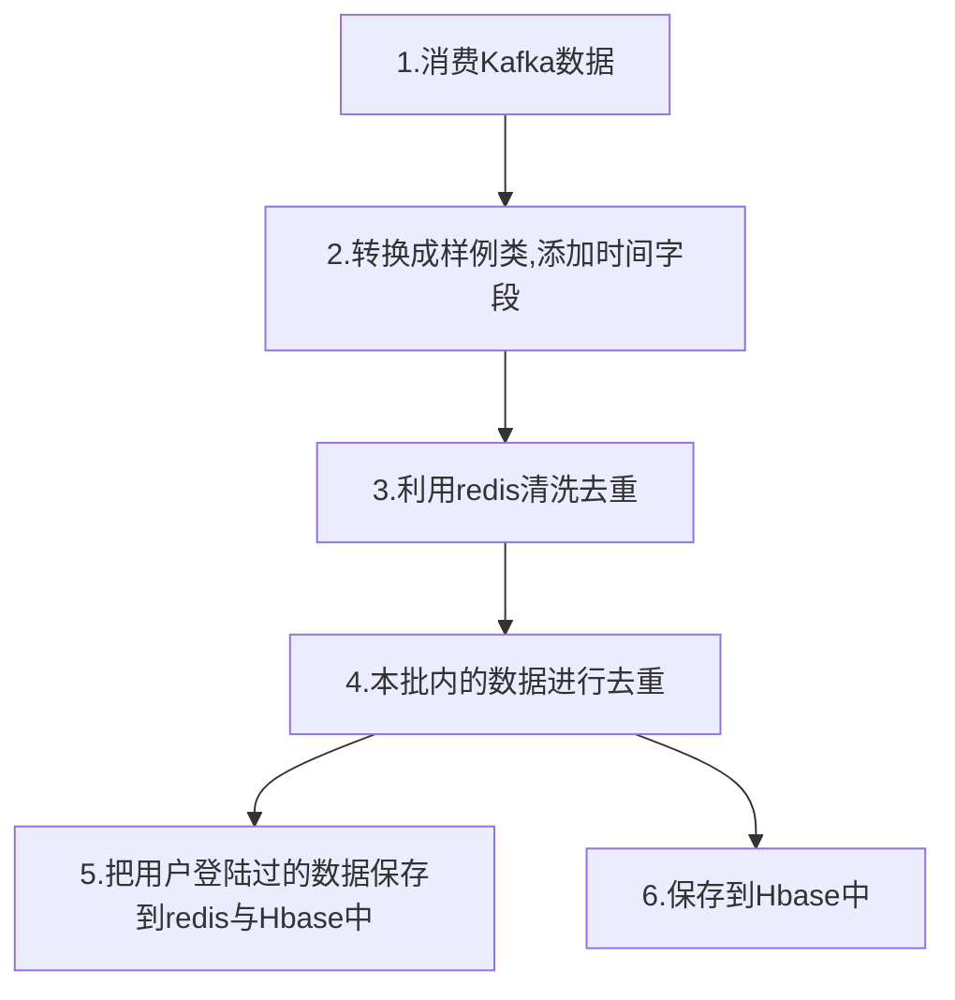
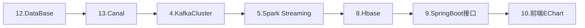
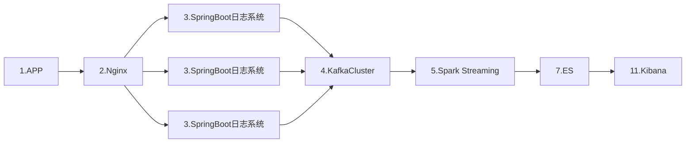
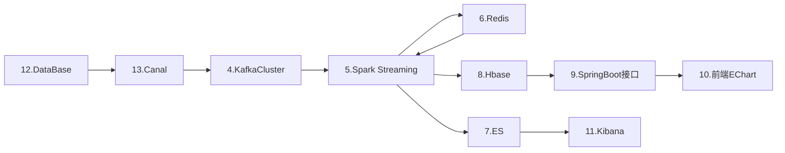

# 实时项目学习

## 一、硬件准备

1. CPU : I5 or Better
2. 内存：最少16G(大概率会掉服务，最好24或32)


## 二、框架技术支持

以下为需要的框架及技术

1. Hadoop
2. Zookeeper
3. Kafka
4. Redis
5. Nginx
6. HBase
7. Phoenix
8. SpringBoot
9. Canal
10. ElsaticSearch
11. Kiberna


## 三、整体流程图




## 四、项目模块

### 1、gmall-common

> 本模块为放置常量的模块，Kafka的消费者主题以及ES的索引信息名均放置此处

### 2、gmall-logger

>本模块为配置Kafka消费代码的模块
>
>本模块会给日志数据添加时间戳
>
>本模块会将日志数据写入本地
>
>本模块会将日志数据传入Kafka
>
>本模块最终会打成Jar包放置集群运行

### 3、gmall-mocker

>本模块为模拟日志数据生成的模块
>
>可以在本模块配置日志生产的数量等信息

### 4、gmall-realtime

>本模块为实时需求代码的编写模块
>
>所有实时的需求均会在本模块完成
>
>根据实时需求会将数据写入Redis和Phoenix(HBase)或者ES

### 5、gmall-publisher

>本模块会编写需求完成后将数据展示给报表部门的数据接口
>
>本模块会将数据写入Spring Boot项目页面，供报表部门获取数据

### 6、gmall-canal

> 本模块为canal组件模块
>
> 本模块会将监控到的数据库变化信息进行处理并传入Kafka

### 7、dw-chart

> 本模块为报表模块
>
> 本模块会将处理好的数据获取到并封装到Echart进行报表展示


## 五、项目需求

### 1、日活需求

#### 1）流程图




#### 2）程序执行流程

> 1）创建SparkConf配置
>
> 2）根据SparkConf创建Sparkstreaming
>
> 3）从Kafka工具类获取主题消费流
>
> 4）从流中获取每一批数据转换成样例类，并添加两个时间字段
>
> 5)	数据先会根据Redis进行跨批次去重
>
> 6）然后将跨批次去重的结果进行同批次去重
>
> 7）将去重后的数据中mid先保存到redis以备下次去重使用
>
> 8）将去重后的所有数据保存到HBase

#### 3）注意点

> 1）为什么要先跨批次去重，再同批次去重
>
> ​		数据清洗的原则是首先执行去重力度大的操作
>
> ​		跨批次去重的清洗力度比同批次去重的力度大很多
>
> ​		很少有人同批次(5S)登陆2次		

> 2）mid为什么保存到redis
>
> ​		首先redis是保存数据在内存的，读写速度很快
>
> ​		其次redis中的set特性可以用作去重操作		

> 3）为什么数据不全部保存到redis，而是保存到HBase
>
> ​		首先数据保存到Redis，虽然读写快，但对内存要求高。
>
> ​		其次我们在数据中添加了分时字段，把数据保存在HBase中可以按照维度进行分析

#### 4）优化点

>1）数据转换为样例类

>2）避免重复获取释放连接
>
>​		我们可以根据第5步的实现可以发现有三种实现方法
>
>​		第一种，每条数据都会获取释放Redis连接
>
>​		第二种，每个分区都会获取释放Redis连接
>
>​		第三种，可以从一个Redis连接中获取当天所有数据，然后用广播变量，这样一批数据就只						要一个连接
>
>3）RDD缓存
>
>​		如果一个RDD需多次使用，需缓存下来，提高使用速度


#### 5）项目启动流程

>0、第二章框架技术按顺序(1-7)启动
>
>1、gmall-logger模块打包到集群，在所有节点启动(使用脚本)
>
>2、gmall-realtime模块中的DauAPP(负责创建连接池，获取连接等)
>
>3、gmall-publisher模块负责发布数据
>
>4、dw-chark模块主程序负责实时显示数据(从phoenix取数据发布到端口)
>
>5、gmall-mocker模块的JsonMocker负责产生实时数据(从端口取数据进行实时显示)


### 2、交易额(GMV)需求

#### 1）流程图




#### 2）Canal架构

Canal信息架构
> Message：一次canal从日志榨取的信息，一个message可以包含多个sql执行的结果
>
> > Entry：对应一个sql命令，一个sql可能会对多行记录造成影响
> >
> > >TableName(表名)
> > >
> > >EntryType(实例类型)：ROWDATA(我们要用的)
> > >
> > >StoreValue(存储的数据)：此数据为序列号的数据不可直接使用
> >
> > > StoreValue反序列化后得到RowChange
> >
> > >RowChange：
> > >
> > >> EventType：DDL，DCL关键字等
> > >>
> > >> RowDataList：行数据列表(包含多行数据)
> > >>
> > >> > RowData:(一行数据)
> > >> >
> > >> > > Column：列


#### 3）程序执行流程

>1）创建SparkConf配置
>
>2）根据SparkConf创建Sparkstreaming
>
>3）从Kafka工具类获取主题消费流
>
>4）从流中获取每一批数据转换成样例类，并添加两个时间字段
>
>5)	给手机号脱敏
>
>6）将数据写入HBase(Phoenix)


#### 4）注意点

>1）为什么使用canal
>
>>canal是一个实时监控数据库变化的框架，在数据库中数据被改变后，canal可以监控到
>>并可以实时传输这些数据进行解析或远程同步数据库
>>canal外部套了一层从数据库的壳，因此可以实时获取数据

>2）数据保存到Phoenix的隐式方法
>
>>将数据保存到Phoenix需要借助org.apache.phoenix.spark._
>>本包提供了对rdd的隐式扩展

#### 5）项目启动流程

>0、第二章框架技术按顺序(1，2，3，8，6，7)启动
>
>1、gmall-canal模块中的CanalClient(负责监控数据库变化，进行数据同步传输到Kafka)
>
>2、gmall-realtime模块中的OrderApp(负责将Kafka的数据进行转换并存储到Phoenix中)
>
>3、gmall-publisher模块负责发布数据(从phoenix取数据发布到端口)
>
>4、dw-chark模块主程序负责实时显示数据(从端口取数据进行实时显示)


### 3、预警需求

#### 1）流程图




#### 2）需求具体说明

​		**需求：**同一设备，5分钟内三次及以上用不同账号登录并领取优惠劵，并且过程中没有浏览商品。达到以上要求则产生一条预警日志。并且同一设备，每分钟只记录一次预警。


#### 3）程序具体执行流程

>1.创建SparkConf和StreamingContext
>2.读取Kafka事件主题数据创建流
>3.转化为样例类对象
>4.开5分钟的窗口
>5.按照mid做分组处理
>6.对单条数据进行处理
>
>> 6.1三次及以上用不同账号(登陆并领取优惠券)：对uid进行去重
>
>> 6.2没有浏览商品：反面考虑，如果有浏览商品，当前mid不产生预警日志
>>
>> > a.   		创建Set用于存放领券的UID；
>> > 	 		创建用于存放领券涉及的商品ID；
>> > 	 		创建List用于存放用户行为
>> > 	 		定义标志位用于标识是否有浏览行为
>>
>> > b.遍历logIter
>> > 	 		提取时间类型（防止代码冗余）
>> > 	 		判断当前数据是否有领券行为并执行相应的操作
>
>7.将生成的预警日志写入ES


#### 4）注意点

> 1）为什么要写入ES
>
> 	ES支持分词查询，这是ES最大的优势，同时ES对接了Kibana页面显示框架，可以实时的显	示结果

>2）需求的解决思路是什么
>
>   (1)开5分钟的窗口:对应需求的5分组，其次是5秒的步长，如果不配，默认是批次的时间间隔
>    (2)按照mid分组：必须是一设备多账号，故按照mid分组
>    (3)三次不同账户：对分组后的uid进行去重
>    (4)没有浏览商品：就是有浏览商品的行为就不产生预警日志
>    (5)每分钟记录一次：在ES存储中，我们可以把ID设置为分钟时间戳，这样可以对每分钟去重


#### 5）项目启动流程

>0、第二章框架技术按顺序(2，3，5，8，10，11)启动
>
>1、gmall-realtime模块下的AlertCouponApp
>
>2、gmall-mocker模块中的JsonMocker(负责产生数据)
>
>3、Kibana页面实时显示变化数据


### 4、灵活分析需求

#### 1）流程图

##### 1.整体流程图



##### 2.核心流程


#### 2）需求具体说明

​		**需求：**提供一个能够根据文字及选项等条件，进行灵活分析判断的数据功能。

| **日期**   | 查询数据的日期                 |
| ---------- | ------------------------------ |
| **关键字** | 根据商品名称涉及到的词进行搜索 |

返回结果

| **饼图**             | **男女比例占比**                                             | 男  ，女 |
| -------------------- | ------------------------------------------------------------ | -------- |
| **年龄比例占比**     | 20岁以下，20-30岁，30岁以上                                  |          |
| **购买行为数据明细** | 包括，用户id,性别年龄，级别，购买的时间，商品价格，订单状态，等信息。  可翻页。 |          |


#### 3）程序执行流程

>1.业务数据变化，canal将变化数据传入kafka
>2.gmall-realtime中的saveUserInfotoredis将用户数据保存到redis
>3.gmall-realtime中的selectApp将kafka流中的order_info和order_detail合并
>4.然后再从redis中读取用户数据进行合并
>5.最后的结果保存到ES


#### 4）注意点

1.样例类转换成为JSON字符串

```
pom.xml
<dependency>
    <groupId>org.json4s</groupId>
    <artifactId>json4s-native_2.11</artifactId>
    <version>3.5.4</version>
</dependency>

导入包
import org.json4s.native.Serialization
在转换前进行隐式转换
implicit val formats=org.json4s.DefaultFormats
val orderInfoJson: String = Serialization.write(orderInfo)

```


2.Java集合与Scala集合之间互转

使用转换包进行转换

```
import collection.JavaConverters._
```


#### 5）项目启动流程

>0、启动2，3，4，9，10，11
>
>1、gmall-canal模块中CanalClient，监测数据库，传输变化数据到kafka
>
>2、gmall-realtime模块中的SaveUserInfoToRedisApp，读取kafka流中user主题数据
>
>3、gmall-realtime模块中的SaleDetailApp，对order_info,order_detail,user_info数据合并并写入ES
>
>4、调用mysql脚本中的存储过程，产生模拟数据测试
>
>5、在kibana中查看产生的数据


## 六、数据发布及实时显示

### 1、数据发布

#### 1）数据发布要求

​	将存入HBase中的数据取出后，发布到SpringBoot页面上，供实时显示界面使用

#### 2）数据发布相关细节

1.SpringBoot映射

1. 第一层：资源文件夹中mapper包对应源码文件中的mapper包
2. 第二层：资源文件夹中mapper包中的(名称.xml)对应源码文件中的mapper包中的(名称.java)


2.Springboot的架构调用

1. mapper：对DAO的封装，为持久化层，主要对数据进行访问(增删改查)
2. service：业务逻辑层，主要负责业务处理和数据传递，将数据访问层传来的数据加工处理，并将数据传给表示层。
3. controller：表示层，主要负责将业务逻辑层处理好的数据展示给用户。


### 2、实时显示

本模块的设计及实现不是大数据部门的业务范畴，故直接调用接口实现实时显示。


## 七、本项目使用的端口

>hadoop
>
>8020	HDFS传输端口
>
>9870	HDFS页面端口
>
>8088	Yarn页面端口

>Zookeeper
>
>2181	框架访问ZK的通信端口
>
>2888	zk内部通信端口，Leader监听此端口
>
>3888	ZK选举端口

> Kafka
>
> 9092	Kafka集群默认的通信端口

> Redis
>
> 6379	Redis服务端口

> Nginx
>
> 80		Nginx默认端口，如造成冲突，可改

> Hbase
>
> 16010	Hbase集群监控
>
> 16000	RegionServer接入

> Canal
>
> 11111	canal默认端口

> 数据发布(gmall-publisher)接口
>
> 8070

> 数据实时监控访问接口
>
> 8087

> Kibana
>
> 5601	页面访问端口

>ElsaticSearch
>
>9200	Http外部通信
>
>9300	Tcp集群内部通信